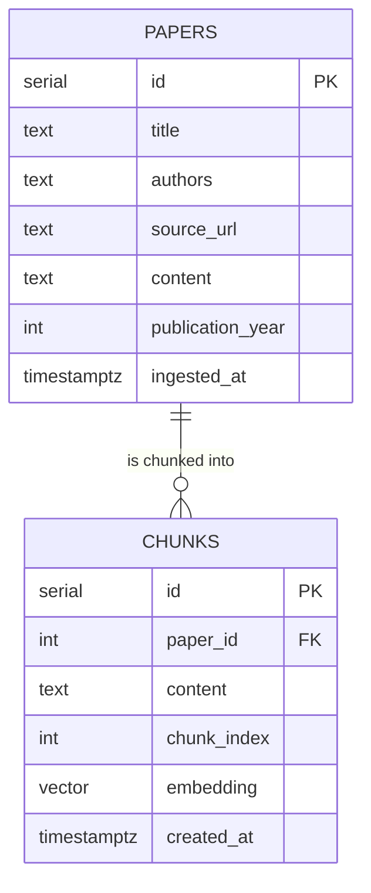

<p align="center">
  
</p>

# Logos

A research assistant chatbot that lets philosophers, grad students, and other academics query recent preprints in philosophy of science and formal epistemology, grounded in papers from 2023–2026 that general-purpose AI models don't have reliable access to just yet.

Built as part of the AI Engineering component of Launch School's Capstone program.

---

## What it does

- Ingests PDF preprints from [PhilSci-Archive](https://philsci-archive.pitt.edu/)
- Chunks and embeds the extracted text using OpenAI's embedding API
- Stores source documents and vector embeddings in PostgreSQL via pgvector
- Retrieves the most semantically relevant chunks for a given user query
- Generates grounded answers using OpenAI's `gpt-4o`
- Supports multi-turn conversations with session-scoped history

---

## Corpus

The corpus consists of 21 preprints on **epistemic opacity in AI/ML models**, spanning a live philosophical debate in the epistemology and philosophy of science literature from 2023 to 2026.

The corpus was chosen deliberately because these papers form an active, interconnected debate with dense citation chains, terms defined in one paper and used across many others, and papers that directly refute claims from earlier papers. These features provide a strong test case for a simple RAG architecture.

The papers are sourced primarily from [PhilSci-Archive](https://philsci-archive.pitt.edu/) and cover:

- Whether deep learning opacity undermines scientific
  justification (Duede 2023; Duede & Davey 2024)
- Whether AI-based science poses a social epistemological problem
  (Koskinen 2024; Peters 2024a, 2024b; Ortmann 2025)
- The role of reliability, trust, and epistemic control in
  ML-based science (Grote, Genin & Sullivan 2024; Duran 2025; Ratti 2025)
- Case studies including AlphaFold (Zakharova 2024; Ortmann 2025)
  and LLMs (Zahavy 2026; Pietsch 2026; Ladyman & Nefdt 2026)

**By year:** 1 paper (2023), 7 papers (2024), 9 papers (2025), 4 papers (2026)

---

## Retrieval Challenges & Observability

The Gradio UI surfaces the full retrieval trace alongside each answer:

- **Retrieved Chunks** accordion — the 5 chunks passed to the LLM, with paper title, similarity score, and the first 300 characters of content
- **Full Prompt** accordion — the exact prompt string sent to `gpt-4o`, including the assembled context

This makes it possible to inspect not just what the LLM answered, but what it was given as context. This provides the critical link between retrieval quality and answer quality identified during the diagnosis phase.

Three structural failure modes were identified during the initial diagnosis phase and are documented in full in `DIAGNOSIS.md` and summarised in `DIAGNOSIS_SUMMARY.md`.

These three failure modes were partially addressed with:

- Sentence-aware chunking with larger chunk size (1024  
  chars via NLTK)
- Publication year metadata in retrieval context labels
- System prompt guidelines for temporal awareness and  
  one-sided context
- Conversation history to support follow-up queries

> Improvements are ongoing. See more in `DIAGNOSIS_SUMMARY.md`

---

## Tech stack

- **Python** — application language
- **PostgreSQL + pgvector** — source store and vector index
- **OpenAI API** — text embeddings (`text-embedding-3-small`) and answer generation (`gpt-4o`)
- **PyMuPDF** — PDF text extraction
- **NLTK** — sentence tokenization for chunking
- **Gradio** — UI and observability display
- **python-dotenv** — secrets management

---

## Architecture

The app separates three distinct data paths:

**Write path** — PDF → ingestion → source store (`papers` table)

**Derive path** — source store → chunking → embedding → vector index (`chunks` table)

**Read path** — user query → embed query → similarity search → LLM generation → grounded answer

The derive path is a pure function of the source store. The entire vector index can be deleted and rebuilt from scratch without re-ingesting any PDFs. See `scripts/rebuild_index.py`.

### Layers

```
handlers/       HTTP-equivalent layer — Gradio functions that wire UI to services
services/       Orchestration — ingestion, indexing, and query use cases
domain/         Entities and interfaces — Paper, Chunk, QueryResult, abstract clients
infrastructure/ External tools — PDF parser, embedding client, vector DB, LLM client
```

---

## Database schema



---

## Setup

**1. Clone the repo and create a virtual environment**

```bash
git clone <repo-url>
cd logos
python -m venv .venv
source .venv/bin/activate
```

**2. Install dependencies**

```bash
pip install -r requirements.txt
python -c "import nltk; nltk.download('punkt_tab')"
```

**3. Configure environment variables**

Copy `.env.example` to `.env` and fill in your credentials:

```
DATABASE_URL=postgresql://localhost/logos
OPENAI_API_KEY=your_key_here
```

**4. Set up the database**

```bash
createdb logos
python -m scripts.setup_db
```

---

## Running the app

**Launch the Gradio UI** (main entry point):

```bash
python -m scripts.app
```

Open `http://127.0.0.1:7860` in your browser.

---

## Scripts

| Script        | Path                       | Description                                                |
| ------------- | -------------------------- | ---------------------------------------------------------- |
| **App**       | `scripts/app.py`           | Main entry point — launches the Gradio UI                  |
| Ingest        | `scripts/ingest_papers.py` | Extracts text from PDFs and saves to the `papers` table    |
| Rebuild index | `scripts/rebuild_index.py` | Clears and rebuilds the vector index from the source store |
| Query (CLI)   | `scripts/query.py`         | One-shot CLI query tool — accepts a question as `sys.argv` |
| Setup DB      | `scripts/setup_db.py`      | Creates tables and HNSW index — run once on first setup    |

Run ingestion and indexing in order when adding new papers:

```bash
python -m scripts.ingest_papers
python -m scripts.rebuild_index
```

Query from the CLI without launching the UI:

```bash
python -m scripts.query "What is epistemic opacity?"
```
