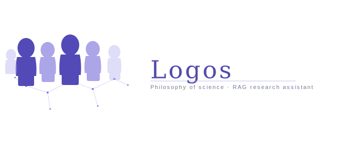
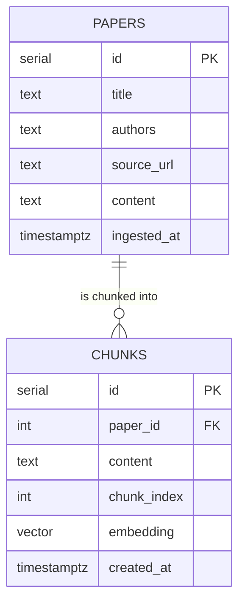

<p align="center">
  
</p>

# Logos

A research assistant chatbot that lets philosophers, grad students, and other academics query recent preprints in philosophy of science and formal epistemology, grounded in papers from 2024–2026 that general-purpose AI models don't have reliable access to just yet.

Built as part of the AI Engineering component of Launch School's Capstone program.

---

## What it does

- Ingests PDF preprints from [PhilSci-Archive](https://philsci-archive.pitt.edu/)
- Chunks and embeds the extracted text using OpenAI's embedding API
- Stores source documents and vector embeddings in PostgreSQL via pgvector
- Retrieves the most semantically relevant chunks for a given user query
- Generates grounded answers using OpenAI's `gpt-4o`

---

## Tech stack

- **Python** — application language
- **PostgreSQL + pgvector** — source store and vector index
- **OpenAI API** — text embeddings (`text-embedding-3-small`) and answer generation (`gpt-4o`)
- **PyMuPDF** — PDF text extraction
- **Gradio** — UI and observability display
- **python-dotenv** — secrets management

---

## Architecture

The app separates three distinct data paths:

**Write path** — PDF → ingestion → source store (`papers` table)

**Derive path** — source store → chunking → embedding → vector index (`chunks` table)

**Read path** — user query → embed query → similarity search → LLM generation → grounded answer

The derive path is a pure function of the source store. The entire vector index can be deleted and rebuilt from scratch without re-ingesting any PDFs. See `scripts/rebuild_index.py`.

### Layers

```
handlers/       HTTP-equivalent layer — Gradio functions that wire UI to services
services/       Orchestration — ingestion, indexing, and query use cases
domain/         Entities and interfaces — Paper, Chunk, QueryResult, abstract clients
infrastructure/ External tools — PDF parser, embedding client, vector DB, LLM client
```

---

## Database schema



---

## Repo structure

```
logos/
├── .env                          # API keys and DB connection string (never committed)
├── .gitignore
├── requirements.txt              # pinned dependencies
├── README.md
│
├── data/
│   └── papers/                   # downloaded PDFs (gitignored)
│
├── src/
│   ├── domain/
│   │   ├── entities.py             # Paper, Chunk, QueryResult dataclasses
│   │   └── interfaces.py         # abstract base classes (EmbeddingClient, LLMClient, etc.)
│   │
│   ├── services/
│   │   ├── ingestion.py          # write path: PDF → text → source store
│   │   ├── indexing.py           # derive path: source store → chunks → embeddings → vector index
│   │   └── query.py              # read path: query → retrieve → generate → answer
│   │
│   ├── infrastructure/
│   │   ├── db.py                 # PostgreSQL connection and pgvector setup
│   │   ├── pdf_parser.py         # PyMuPDF wrapper
│   │   ├── embedding.py          # OpenAI embeddings client
│   │   └── llm.py                # OpenAI llm client
│   │
│   └── handlers/
│       └── app.py                # Gradio UI — wires everything together
│
└── scripts/
    ├── setup_db.py               # creates tables (run once)
    └── rebuild_index.py          # deletes and rebuilds vector index from source store
```

---

## Setup

**1. Clone the repo and create a virtual environment**

```bash
git clone <repo-url>
cd logos
python -m venv .venv
source .venv/bin/activate
```

**2. Install dependencies**

```bash
pip install -r requirements.txt
```

**3. Configure environment variables**

Copy `.env.example` to `.env` and fill in your credentials:

```
DATABASE_URL=postgresql://localhost/logos
OPENAI_API_KEY=your_key_here
```

**4. Set up the database**

```bash
python scripts/setup_db.py
```

---

## Corpus

The app is seeded with preprints on **epistemic opacity in AI/ML models**, drawn from a tightly-knit debate in philosophy of science.
